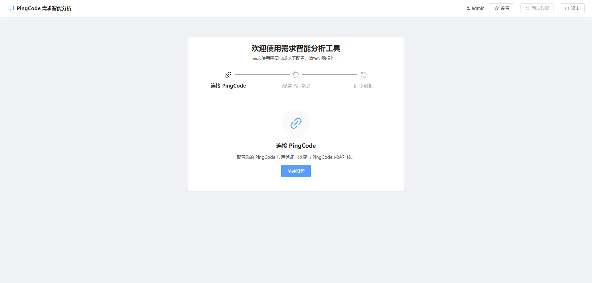

# PingCraft

> **适用环境与版本**：**PingCraft** 面向 [PingCode](https://pingcode.com/) 官网环境 **6.13.5** 版本的开放 API 与数据结构为开发与验证基准。若使用私有化部署或其它主版本，字段或接口行为可能与本文描述不一致，请以实际环境为准。

> **代码现代化**：项目已完成 **JavaScript → TypeScript** 全面重构。前端（Vue 3 + TS）与后端（Express + TS）均以 TypeScript 编写；后端开发使用 `tsx` 热重载，生产通过 `tsc` 编译至 `dist/` 后运行。

[](https://vuejs.org/)
[](https://www.typescriptlang.org/)
[](https://vitejs.dev/)
[](https://element-plus.org/)
[](https://pinia.vuejs.org/)
[](https://echarts.apache.org/)
[](https://nodejs.org/)
[](https://expressjs.com/)
[](https://www.langchain.com/)
[](https://sequelize.org/)
[](https://www.seekdb.com/)
[](https://vitest.dev/)
[](https://www.docker.com/)

**PingCraft** 是一款基于 **AI** 的需求智能分析与导入工具：上传 Word / Markdown / TXT，用大模型解析为结构化工作项，与已同步的 [PingCode](https://pingcode.com/) 项目做**向量相似度匹配与查重**，并可**统计分析**、**AI 解读报告**与**导出 PDF**，适合团队统一接入 PingCode 前的需求梳理与批量建单。

---

## 核心亮点

| 亮点 | 说明 |
|------|------|
| **全栈 TypeScript** | 前后端均已 TS 化：后端 `strict` 模式、`NodeNext` 模块解析；开发 `tsx watch`，生产 `tsc` → `node dist/`。 |
| **LLM 需求解析** | LangChain 编排，从非结构化文档识别多项目、拆分为工作项；输出标题、描述、优先级、预估工时、计划时间、负责人及**解决方案建议**，类型对齐 PingCode（story / task / bug / feature / epic）。 |
| **多模型 · 按用户配置** | 支持 **OpenAI 兼容 API** 与 **Anthropic**；多套模型、默认模型、**按用户**选择分析用 LLM，便于混合部署。 |
| **SeekDB 向量匹配** | 项目名称与工作项语义入向量库（SeekDB），**推荐目标项目**，并对历史工作项做 **New / Similar** 与匹配度展示，抑制重复导入。 |
| **项目统计与可视化** | 按已同步项目拉取统计：工作量、状态分布、负责人 / 类型 / 优先级分布等；**ECharts** 饼图与柱状图呈现。 |
| **AI 分析报告 · PDF** | 基于统计数据由 LLM 生成 **Markdown 解读**（`markdown-it` 渲染）；支持 **html2canvas + jsPDF** 将报告导出为 PDF。 |
| **SSE 实时导入** | 批量创建 PingCode 工作项时通过 **Server-Sent Events** 推送进度，前端进度条与当前项展示；支持可配置导入并发。 |
| **数据与权限** | 关系数据与向量均按 `user_id` 隔离；**JWT** + **RBAC**；敏感字段 **AES-256-GCM** 加密存储；登录/注册限流；PingCode **Token 自动刷新**。 |
| **引导与可追溯** | **Setup Wizard** 串联 PingCode 连接、模型配置、数据同步；**导入记录**可查看明细与原文，并**恢复历史分析结果**继续编辑导入。 |
| **PingCode 双授权** | 设置中可选 **用户授权**（OAuth 授权码）或 **企业授权**（Client Credentials）；企业模式具备更广数据访问范围，请妥善保管 Client Secret。 |
| **仪表盘与数据管理** | 连接后顶部 **数据概览**；**项目列表**、**工作项列表**独立分页浏览；设置内支持 **清除同步数据**（仅本地缓存与向量，不删云端与导入记录）。 |
| **可观测性** | `/health` 健康检查（含 DB / SeekDB）；管理员可查审计日志；Docker 镜像内置 `HEALTHCHECK`。 |

---

## 功能概览

| 功能 | 说明 |
|------|------|
| **本地账号** | 用户名 / 密码注册与登录，JWT 鉴权（含滑动续期响应头） |
| **PingCode 连接** | Client ID / Secret；**用户授权**或**企业授权**，同步项目与工作项 |
| **数据同步** | 增量同步与元数据（类型 / 状态 / 属性 / 优先级），向量索引，可配置分批与间隔 |
| **需求分析** | `.docx` / `.md` / `.txt` 上传，LLM 结构化输出 |
| **智能匹配** | 项目推荐、工作项语义查重（New / Similar，阈值可配） |
| **元数据映射** | `type_id` / `priority_id` 等名称自动映射为 PingCode UUID |
| **批量导入** | 支持自动创建新项目；SSE 流式进度；可配置 API 并发数与工时单位换算 |
| **统计分析** | 项目维度统计与图表、LLM 分析报告、PDF 下载（统计结果带缓存） |
| **模型配置** | 多模型 CRUD、连接测试、用户级默认模型 |
| **导入记录** | 历史记录、明细、原文、恢复分析结果；需求文档按 TTL 清理 |
| **用户与 RBAC** | 管理员用户 / 角色 / 权限管理 |
| **数据概览** | 仪表盘展示已同步项目数、工作项数、类型数、状态数 |
| **已同步浏览** | 「项目列表」「工作项列表」查看本地缓存的 PingCode 数据 |
| **清除同步数据** | 设置中清除本账号本地项目、工作项、元数据与向量索引 |

---

## 技术架构

| 层级 | 选型 |
|------|------|
| **前端** | Vue 3、TypeScript、Vite 7、Element Plus、Pinia、Vue Router、ECharts（vue-echarts） |
| **后端** | Node.js 22 LTS、Express 5、**TypeScript（ESM）**、Sequelize 6 |
| **数据库** | [SeekDB](https://www.seekdb.com/)（MySQL 兼容 + 向量） |
| **AI** | LangChain、OpenAI 兼容 API、Anthropic（可选） |
| **测试** | Vitest（前后端）、vue-tsc / tsc 类型检查 |
| **实时** | SSE（导入进度） |
| **包管理** | pnpm（`frontend/` 与 `backend/` 分别安装） |

**后端运行方式：**

| 场景 | 命令 | 说明 |
|------|------|------|
| 开发 | `pnpm dev` | `tsx watch src/index.ts`，热重载 |
| 构建 | `pnpm build` | `tsc -p tsconfig.build.json` → `dist/` |
| 生产 | `pnpm start` | `NODE_ENV=production node dist/index.js` |
| 类型检查 | `pnpm typecheck` | `tsc --noEmit` |

配置加载：后端按 `NODE_ENV` 读取 `backend/.env` 与 `backend/.env.{development\|production\|test}`；前端通过 Vite `import.meta.env` 读取 `frontend/.env*`。

---

## 前置条件

- Node.js **20.19+** 或 **22.12+**（与 **Vite 7** 一致；推荐 **22 LTS**）
- **pnpm**
- **Docker** 与 **Docker Compose**（可选：一键 SeekDB + 应用，或仅起 SeekDB 本地开发）
- PingCode 开放平台 **Client ID / Secret**（用户授权需配置 OAuth 回调；**6.13.5 官网试用** 环境与开放能力为当前主要适配目标）
- LLM：**OpenAI 兼容** 或 **Anthropic** API Key

---

## 安装与配置

### 克隆

```bash
git clone https://github.com/knqiufan/PingCraft.git
cd PingCraft
```

### 依赖

```bash
cd backend
pnpm install
```

```bash
cd ../frontend
pnpm install
```

### 环境变量

仓库提供 `.env*.example`，复制后填写：

```bash
cd backend
cp .env.development.example .env.development
```

```bash
cd ../frontend
cp .env.development.example .env.development
```

加载顺序：先 `.env`，再 `.env.{NODE_ENV}`（后者覆盖）。

- **开发**：参考 `backend/.env.development.example`
- **生产 / Docker**：将 `backend/.env.production.example` 复制为 `backend/.env.production`，**务必设置强随机 `JWT_SECRET` 与 `ENCRYPTION_KEY`**；Docker 场景下 `SEEKDB_*`、`CORS_ORIGIN`、`FRONTEND_URL` 可由 `docker-compose.yml` 注入覆盖

以下为本地开发可参考的 **示例片段**（勿将真实密钥提交到仓库）。

**后端**（`backend/.env.development`）：

```env
NODE_ENV=development
PORT=3000

# CORS（前端开发地址）
CORS_ORIGIN=http://localhost:5177

# 前端地址（OAuth 回调重定向用）
FRONTEND_URL=http://localhost:5177

# JWT 密钥（生产环境务必更换）
JWT_SECRET=your_jwt_secret

# 敏感字段加密密钥（生产必须设置；开发可留空使用固定派生 key）
# ENCRYPTION_KEY=

# PingCode OAuth（host / redirect_uri 全局配置；client_id/secret 可在「设置」中按用户配置）
PINGCODE_REDIRECT_URI=http://localhost:3000/auth/callback
# 必填：PingCode 访问根地址（须含协议，如 http 或 https；若含端口一并写上）
PINGCODE_HOST=http://your-pingcode-host:port

# 工时单位：minute / hour / day（默认 hour）
PINGCODE_WORKLOAD_UNIT=hour

# SeekDB（与 docker compose 中端口一致）
SEEKDB_HOST=127.0.0.1
SEEKDB_PORT=2881
SEEKDB_USER=root
SEEKDB_PASSWORD=
SEEKDB_DATABASE=pingcode_agent
SEEKDB_RETRY_COUNT=5
SEEKDB_RETRY_INTERVAL_MS=2000

# 可选：同步批次、导入并发、查重阈值等
# SYNC_WORK_ITEM_BATCH_SIZE=25
# SYNC_BATCH_DELAY_MS=500
# PINGCODE_IMPORT_CONCURRENCY=3
# DUPLICATE_SIMILARITY_THRESHOLD=0.75
# DEMAND_FILE_TTL_HOURS=720
# STATS_CACHE_TTL_MS=300000
```

**前端**（`frontend/.env.development`）：

```env
VITE_API_BASE_URL=http://localhost:3000
VITE_APP_TITLE=PingCraft（开发）
```

生产环境请对应修改 `frontend/.env.production` 中的 `VITE_API_BASE_URL` 与 `VITE_APP_TITLE`。

### 启动 SeekDB（Docker）

```bash
docker compose up -d seekdb
```

默认端口 **2881**（SQL）、**2886**（obshell 控制台，见 SeekDB 文档），数据目录 `./seekdb_data`。请保证 `backend/.env*` 中 `SEEKDB_HOST` / `SEEKDB_PORT` 一致。

### 开发启动

```bash
cd backend
pnpm dev
```

```bash
cd frontend
pnpm dev
```

浏览器访问 **http://localhost:5177**（Vite 端口以 `frontend/vite.config.ts` 为准）。首次进入可使用 **Setup Wizard** 完成 PingCode、模型与同步。

默认管理员（首次启动自动创建）：`admin` / `qwe@123`。

### 类型检查与测试

```bash
cd backend
pnpm typecheck
pnpm test
```

```bash
cd frontend
npx vue-tsc --noEmit
pnpm test
```

测试文件位于 `backend/src/**/__tests__/**/*.test.ts` 与 `frontend/src/**/__tests__/**/*.test.ts`。

### 生产构建（本地）

```bash
cd backend
pnpm build
pnpm start
```

```bash
cd frontend
pnpm build
```

前端产物在 `frontend/dist/`；Docker 部署时会复制到 `backend/public/` 由 Express 同源托管。

---

## 使用流程

1. 注册 / 登录 → Setup Wizard 完成 PingCode、模型、同步。
2. 上传需求文档 → 查看推荐项目与 New / Similar → 编辑字段（元数据来自 PingCode）。
3. 导入到 PingCode，观察 SSE 进度。
4. 在「统计分析」中查看图表、生成 AI 报告、按需导出 PDF。
5. 在「导入记录」中追溯或恢复分析结果。
6. 可在「项目列表」「工作项列表」核对已同步数据；在「设置」中切换授权方式或 **清除同步数据**（仅本地）。

---

## Docker 启动

同一镜像内编译后端 TypeScript、构建前端，并由 Express 托管静态资源，对外 **单一端口 3000**。

1. 准备 `backend/.env.production`（可从 `.env.production.example` 复制），**至少配置 `JWT_SECRET` 与 `ENCRYPTION_KEY`**。
2. 在项目根目录执行：

```bash
docker compose up -d
```

3. 访问 **http://localhost:3000**，注册后按引导完成配置。

常用命令：

```bash
docker compose logs -f app
```

```bash
docker compose down
```

相关文件：`Dockerfile`、根目录 `docker-compose.yml`、`.dockerignore`。

### Compose 配置说明

- **SeekDB 镜像**使用环境变量 **`ROOT_PASSWORD`** 设置 root 密码（见 [部署用 Docker 文档](https://www.oceanbase.ai/docs/zh-CN/deploy-by-docker/)）；若设置非空密码，请让 `app` 服务的 **`SEEKDB_PASSWORD` 与其一致**。
- **`depends_on` 仅保证启动顺序**，不等待数据库完全就绪；后端连接 SeekDB 带重试，首次拉镜像启动较慢属正常现象。
- **`env_file`** 指向主机上的 `backend/.env.production`，若文件不存在，`docker compose up` 会报错，需先创建该文件。
- 上传文件通过卷 `./uploads` 持久化到 `backend/uploads`。

---

## 项目结构

```
PingCraft/
├── backend/
│   ├── src/
│   │   ├── config/          # 环境加载与校验
│   │   ├── middleware/      # JWT、RBAC、日志、限流、Token 刷新、错误处理
│   │   ├── models/          # Sequelize 模型（TypeScript）
│   │   ├── prompts/         # 需求分析 / 统计解读 Prompt
│   │   ├── routes/          # API 路由
│   │   ├── services/        # DB、PingCode、Agent、解析、导入、审计等
│   │   ├── types/           # 共享类型
│   │   ├── utils/           # 加解密、重试、响应封装等
│   │   ├── app.ts           # Express 应用装配
│   │   └── index.ts         # 入口
│   ├── tsconfig.json
│   └── tsconfig.build.json
├── frontend/
│   └── src/
│       ├── api/             # Axios 客户端与类型
│       ├── components/      # dashboard、workItems、stats、records、settings…
│       ├── composables/
│       ├── stores/          # Pinia（app / user）
│       ├── utils/
│       ├── views/
│       └── router/
├── docker-compose.yml
├── Dockerfile
└── README.md
```

> ESM 约定：后端源码为 `.ts`，运行时 / 编译产物仍使用 `.js` 扩展名的 import 路径（`NodeNext`）。

---

## API 前缀概览

| 前缀 | 说明 |
|------|------|
| `/health` | 健康检查（无需认证，含 DB / SeekDB 探测） |
| `/auth` | PingCode OAuth |
| `/auth/local` | 本地注册 / 登录 |
| `/api` | 配置、同步、分析、工作项（含导入与 SSE） |
| `/api/metadata` | 元数据 |
| `/api/models` | 模型配置 |
| `/api/records` | 导入记录与恢复 |
| `/api/stats` | 项目统计与 AI 分析报告 |
| `/api/audit-logs` | 审计日志（管理员） |
| `/api/roles`、`/api/users` | 角色 / 用户（管理接口） |

---

## 安全特性

- JWT 保护业务 API，支持滑动续期（`X-Refreshed-Token`）
- 数据按用户隔离（关系库 + 向量）
- 敏感字段（OAuth Token、Client Secret、LLM API Key 等）**AES-256-GCM** 加密（`ENCRYPTION_KEY`）
- RBAC：`requireAdmin` / `requirePermission`
- 登录 / 注册接口限流
- PingCode access_token 临近过期自动刷新
- 导入记录等资源校验归属用户
- 生产环境启动前校验必填环境变量（`JWT_SECRET`、`ENCRYPTION_KEY` 等）

---

## 相关截图




---

## 许可证

[Apache License 2.0](LICENSE)
